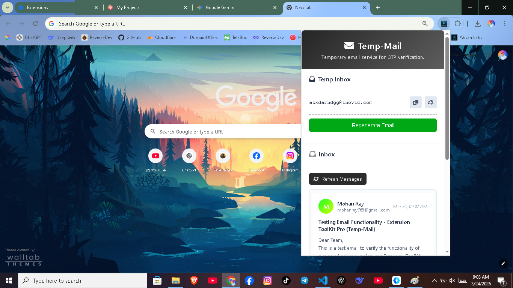

# Extension Toolkit Pro - Tempmail
A lightweight perfectly ready chrome web extension that provides completely free temporary email address for any kind of OTP verification. Protect your real inbox from spam by using a burner email for sign-ups, testing, and verification codes.

## Demo Video

[Watch the Demo](https://youtu.be/7kIcJiBjVLA?si=yvQpz-NtAqkgFr8K)

## Key Features
* Direct setup - easy to setup ( one time installation )
* Instant Email generation - Just click on generate email & your temporary email is ready.
* Auto refresh - Automatically refreshes inbox messages.
* One Tap copy - Click to copy your address to the clipboard instantly.
* Clean UI: Modern, responsive & professional design that works on your desktop perfectly.

## How to setup?
1. Download the release or Clone this repository.
   <pre> git clone https://github.com/ReverseMohan/Extension-Toolkit-Pro.git </pre>
2. Open in Browser:
   Click on extension.
   Click on Manage extension.
   In Top-Left click on **Load unpacked**.
3. Navigate to the folder:
   select the **Extension Toolkit Pro** folder. Now your extension is ready to use.

## Note: 
This tool is intended for privacy and testing purposes. Please do not use it for illegal activities.
